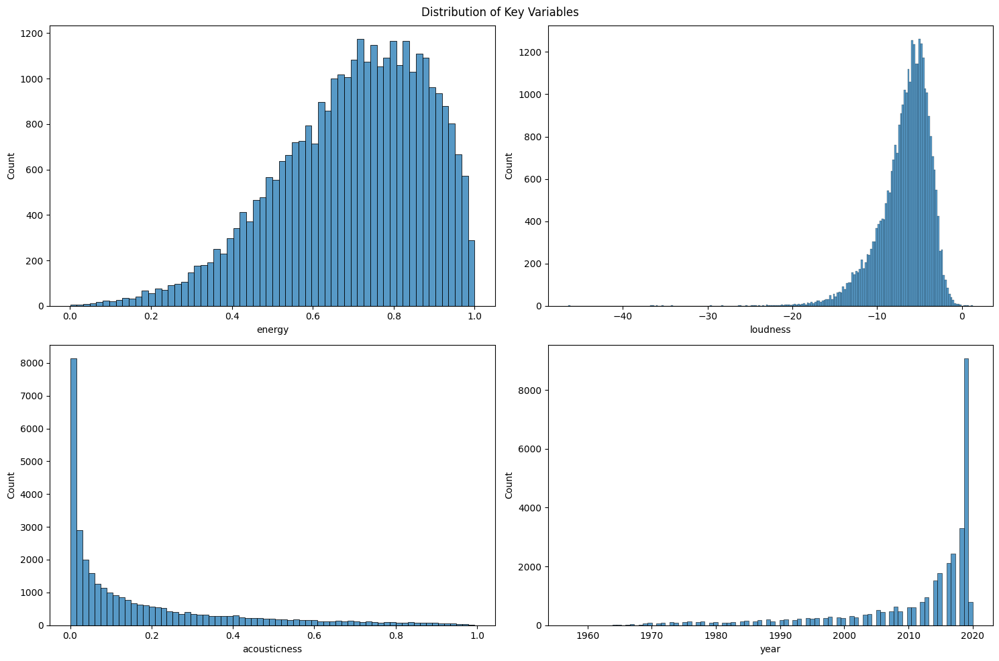
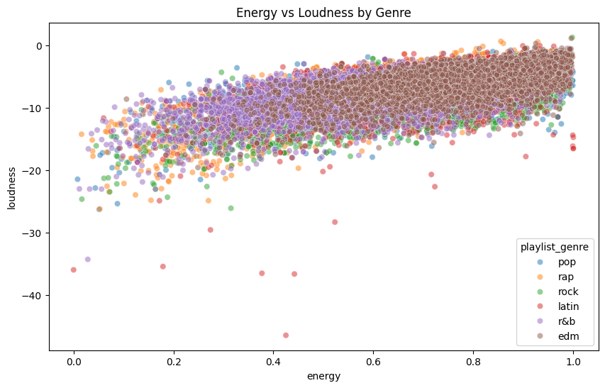
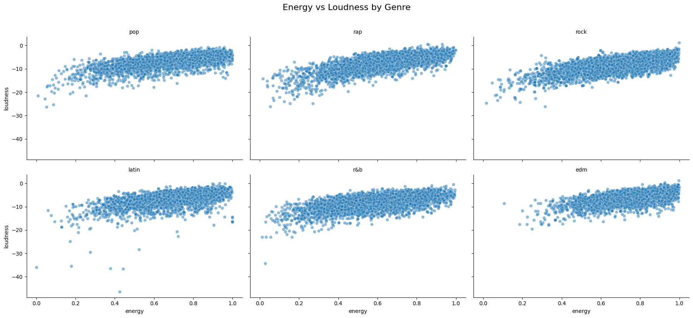
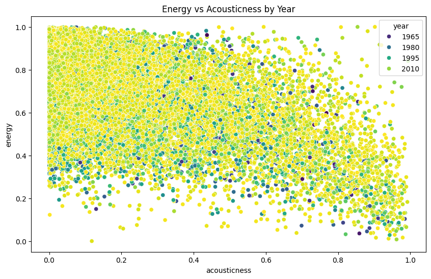
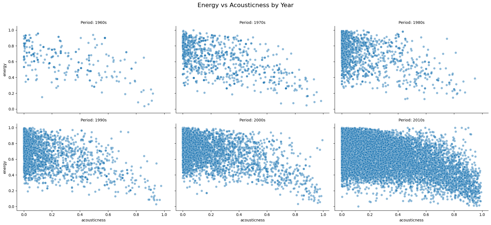

<!-- HEADER -->
<br />
<p align="center">
  <a href="#">
    
  </a>
  <br/>
  <h3 align="center">
    Learn More with Big Data
  </h3>
  <br/>
</p>

## Tim dan Collab Link
<div>
Analisis Big Data C

- Rosydan Amru Tamam (202110370311249)
- Muhammad Zidan Rifardi (202110370311268)
- Bayu Puspito Aji (202110370311291)

Notebook Link : <a href="https://colab.research.google.com/drive/129Msx9kR-mPL3KA-9-cDH3H5LZzYZA_d?usp=drive_link">Click Here<a/>
<div/>

<!--Daftar Isi-->
## Daftar Isi

* [Pendahuluan](#pendahuluan)
* [Package yang Diperlukan](#package-yang-diperlukan)
* [Data Preparation](#data-preparation)
* [Eksplorasi dan Analisa Data](#eksplorasi-dan-analisa-data)
* [Kesimpulan](#kesimpulan)
<br><br>

<!--PENDAHULUAN-->
## Pendahuluan
<div align='justify'>
Dataset "Spotify Songs" yang digunakan dalam penelitian ini dimiliki oleh <a href='https://github.com/rfordatascience/tidytuesday/blob/main/data/2020/2020-01-21/readme.md'>TidyTuesday<a/> yang merupakan data open source untuk analisis data. Dataset ini mencakup berbagai fitur audio, metadata lagu, dan metrik popularitas, seperti `danceability`, `energy`, `tempo`, `acousticness`, dan `popularity`. Data ini merepresentasikan kumpulan informasi penting dari platform Spotify yang memberikan wawasan tentang bagaimana lagu-lagu dikonsumsi oleh audiens. Dengan total 23 variabel, dataset ini menjadi peluang menarik bagi para analis data untuk memahami hubungan antara karakteristik lagu dan popularitasnya.
<br>

Namun, Data yang kompleks memberikan tantangan tersendiri bagi para analis. Berbagai fitur audio memiliki skala dan distribusi yang berbeda, sehingga sulit untuk menyimpulkan pola secara langsung. Selain itu, permasalahan lain seperti adanya nilai yang hilang atau anomali dalam beberapa variabel dapat mengurangi keakuratan analisis.
<br>

Untuk mengatasi tantangan ini, kami menggunakan teknik pembersihan data, eksplorasi statistik deskriptif, dan visualisasi data untuk mengidentifikasi pola utama. Tujuan dari penelitian ini adalah memberikan pemahaman yang lebih baik tentang hubungan antara fitur audio dengan tipe lagunya. Dengan demikian, penelitian ini diharapkan dapat memberikan wawasan bagi musisi dalam menciptakan strategi musik yang lebih efektif dan sesuai dengan preferensi audiens.
<br>

### 1.1 Rumusan Masalah
Berdasarkan latar belakang yang telah ditulis di atas, maka rumusan masalah yang dapat di fokuskan pada penelitian ini yaitu :
1. Bagaimana pengaruh tingkat energi lagu terhadap loudness pada berbagai genre musik di Spotify, dan apakah hubungan ini konsisten di semua genre?
2. Seberapa signifikan pengaruh penggunaan instrumen akustik terhadap tingkat energi lagu, dan bagaimana variasinya berdasarkan era/tahun rilis musik?

### 1.2 Solusi Mengatasi Masalah
Solusi dalam penelitian ini berfokus pada penyelesaian dari rumusan masalah. Berdasarkan rumusan masalah diatas, maka solusinya yaitu :
1. Eksplorasi data berupa distribusi fitur-fitur di dalam dataset.
2. Analisis pengaruh fitur energi lagu terhadap loudness pada tiap genre musik.
3. Analisis pengaruh fitur akustik terhadap fitur energi, serta variasinya berdasarkan tahun rilis.

### 1.3 Teknik Analisis yang Diusulkan
Dalam memberikan solusi, kami menggunakan teknik analisis berikut :
1. Data cleaning serta summary awal untuk mengetahui isi data.
2. Statistik deskriptif untuk mengidentifikasi tren.
3. Visualisasi data berupa histogram dan scatterplot untuk hubungan antar variabel.

### 1.4 Manfaat Analisis
Sehingga penelitian ini dapat memberikan manfaat sebagai berikut :
1. Memahami hubungan antara fitur audio dengan genre lagunya
2. Memberikan strategi bagi musisi untuk menciptakan lagu yang efektik
3. Mengedukasi audiens dengan visualisasi yang lebih mudah dipahami

<div/>
<br>

<!--PACKAGE YANG DIPERLUKAN-->
## Package yang Diperlukan
<div align='justify'>

### 2.1 Python

Sebelum melakukan penelitian ini, instalasi python pada environment local diperlukan. Python yang digunakan pada penelitian ini adalah python 3.10. Untuk mempelajarinya lebih lanjut, dapat menekan <a href="https://www.python.org/downloads/release/python-3100/">disini<a/>.


Selanjutnya, instalasi beberapa library pyton juga diperlukan. Kamu dapat melakukan instalasi library pada terminal python menggunakan `pip`. Tiap library ini yaitu sebagai berikut :

*Pandas - Latest <br>
```sh
pip install pandas
```

*Numpy - Latest <br>
```sh
pip install numpy
```

*Seaborn - Latest <br>
```sh
pip install seaborn
```

*Matplotlib - Latest <br>
```sh
pip install matplotlib
```

*Sklearn - Latest <br>
```sh
pip install sklearn
```

*Scipy - Latest <br>
```sh
pip install scipy
```

### 2.2 Menghilangkan pesan dan peringatan instalasi
Untuk menghilangkan pesan dan peringatan yang muncul akibat pemuatan paket dapat dilakukan fungsi berikut.

```sh
import warnings
warnings.filterwarnings('ignore')
```
<div/>
<br>

<!--DATA PREPARATION-->
## Data Preparation
<div align='justify'>

### 3.1 Sumber Data
<p align='center'>
<a href="#" align='center'>
    
  </a>
<p/>


Data dalam penelitian ini bersumber dari Github <a href='https://github.com/rfordatascience/tidytuesday/blob/main/data/2020/2020-01-21/readme.md'>TidyTuesday<a/>. Dataset ini dapat dikunjungi dengan menekan hyperlink diatas atau klik <a href='https://github.com/rfordatascience/tidytuesday/blob/main/data/2020/2020-01-21/readme.md'>disini<a/>.

### 3.2 Spesifikasi Data

- Tujuan Awal Data : Data ini dikhususkan untuk analisis metada lagu di platform spotify. Data ini dikumpulkan pada `21 Januari 2020` oleh tidytuesday.

- Jumlah Variabel : Dataset ini mencakup 23 variabel yang berisi fitur audio, metadata, dan popularitas lagu. Dictionary data spotify ini adalah sebagai berikut.

|variable                 |class     |
|:---|:---|
|track_id                 |character |
|track_name               |character |
|track_artist             |character |
|track_popularity         |double    |
|track_album_id           |character |
|track_album_name         |character |
|track_album_release_date |character |
|playlist_name            |character |
|playlist_id              |character |
|playlist_genre           |character |
|playlist_subgenre        |character |
|danceability             |double    |
|energy                   |double    |
|key                      |double    |
|loudness                 |double    |
|mode                     |double    |
|speechiness              |double    |
|acousticness             |double    |
|instrumentalness         |double    |
|liveness                 |double    |
|valence                  |double    |
|tempo                    |double    |
|duration_ms              |double    |

- Kekhasan data : Masih terdapat beberapa data kosong terutama di kolom `track_album_release_date`

### 3.3 Data Cleaning

Pertama data di load menggunakan library pandas `pandas.read_csv` untuk membaca file csv dari data spotify.

Teknik data cleaning yang diterapkan adalah sebagai berikut.

- Pemeriksaan data duplikat : Hal ini bermanfaat untuk memastikan tidak ada data sama yang dapat mempengaruhi hasil analisa baik secara deskriptif maupun visualisasi.
- Pemeriksaan data null : Hal ini bermanfaat untuk menghilangkan data rancu karena value yang kosong. Jika ditemukan data yang memiliki kolum `null`, maka data tersebut akan dihapus.
- Ekstraksi Format Tahun : Hal ini bermanfaat untuk mengambil tahun pada fitur `track_album_release_date` yang akan digunakan untuk analisa trend.

### 3.4 Data Cleaned Information

Setelah melakukan proses data cleaning, maka data yang akan di analisis pun sudah siap. Berikut ringkasan awal dari data yang sudah di bersihkan.

Jumlah Data (Count) :
- Terdapat 32,828 lagu yang dianalisis
- Jumlah ini konsisten untuk semua variabel (energy, loudness, acousticness)
- Tidak ada data yang hilang karena jumlahnya sama antara Before dan After

Energy:
- Mean: 0.698603 menunjukkan rata-rata energi lagu cenderung tinggi (skala 0-1)
- Std: 0.180916 menunjukkan variasi energi relatif kecil
- Min-Max: 0.000175 - 1.000000 menunjukkan rentang lengkap dari lagu sangat tenang hingga sangat energik
- Median (50%): 0.721000 sedikit lebih tinggi dari mean, menunjukkan distribusi sedikit miring ke kiri

Loudness:
- Mean: -6.719529 dB, menunjukkan rata-rata volume lagu
- Std: 2.988641 menunjukkan variasi loudness cukup besar
- Min: -46.448000 dB (sangat pelan)
- Max: 1.275000 dB (sangat keras)
- Median: -6.166000 dB dekat dengan mean, menunjukkan distribusi relatif simetris

Acousticness:
- Mean: 0.175352 menunjukkan mayoritas lagu lebih bersifat non-akustik
- Std: 0.219644 menunjukkan variasi tingkat akustik moderat
- Min-Max: 0.000000 - 0.994000 menunjukkan rentang dari fully electronic hingga hampir fully acoustic
- Distribusi miring ke kanan (mean > median 0.080400)

Distribusi Data:
- Energy: Terkonsentrasi di range tinggi (75% data > 0.581000)
- Loudness: Terdistribusi normal dengan beberapa outlier sangat pelan
- Acousticness: Mayoritas rendah dengan beberapa lagu sangat akustik

Insight Penting:
- Mayoritas lagu di Spotify cenderung energik (mean energy 0.69)
- Loudness terdistribusi normal dengan variasi wajar
- Lagu-lagu cenderung non-akustik (75% lagu memiliki acousticness < 0.255000)
<div/>
<br>

<!--EKSPLORASI DAN ANALISA DATA-->
## Eksplorasi dan Analisa Data
<div align='justify'>

### 4.1 Eksploratory Data Analysis
Setelah melakukan eksplorasi dataset, maka ditemukan informasi penting mengenai distribusi data.<br><br>

<p align="center">
  <a>
    
  </a>
</p>

Distribusi Energy (kiri atas):
- Bentuk: Distribusi relatif normal dengan sedikit skewed ke kiri
- Range: 0-1 (normalized)
- Puncak: Sekitar 0.7-0.8, menunjukkan mayoritas lagu di Spotify memiliki energi tinggi
- Interpretasi: Kebanyakan lagu di dataset memiliki karakteristik energetik, sesuai dengan preferensi pendengar musik streaming

Distribusi Loudness (kanan atas):
- Bentuk: Distribusi mendekati normal dengan ekor panjang ke kiri
- Range: -40 dB sampai 0 dB
- Puncak: Sekitar -5 dB sampai -7 dB
- Interpretasi: Mayoritas lagu memiliki loudness yang standar, dengan beberapa outlier lagu yang sangat pelan (quiet)

Distribusi Acousticness (kiri bawah):
- Bentuk: Sangat right-skewed (menceng ke kanan)
- Range: 0-1 (normalized)
- Dominasi: Nilai rendah (0-0.2)
- Interpretasi: Mayoritas lagu bersifat non-akustik, mencerminkan dominasi musik modern yang diproduksi secara digital

Distribusi Year (kanan bawah):
- Bentuk: Highly right-skewed dengan lonjakan tajam di tahun-tahun terkini
- Range: 1960-2020
- Puncak: Sekitar 2015-2020
- Interpretasi: Dataset didominasi oleh lagu-lagu baru, Menunjukkan bias terhadap musik kontemporer, Mencerminkan pertumbuhan eksponensial konten digital di era streaming

Insight Penting:
- Dataset menunjukkan preferensi terhadap Lagu energetik (energy tinggi, Produksi modern (acousticness rendah), Musik kontemporer (tahun terbaru)
- Loudness relatif terstandardisasi, menunjukkan normalisasi volume dalam industri musik
- Dominasi musik non-akustik mencerminkan tren produksi musik digital
- Representasi temporal tidak merata, dengan fokus pada musik era streaming

### 4.2 Menjawab Rumusan Masalah

#### 1. Bagaimana pengaruh tingkat energi lagu terhadap loudness pada berbagai genre musik di Spotify, dan apakah hubungan ini konsisten di semua genre?

Korelasi antara energy dan loudness (0-1) :
|Playlist_genre  |Correlation_score     |
|:---|:---|
|edm             |0.638214|
|latin           |0.587487|
|pop             |0.673739|
|r&b             |0.602092|
|rap             |0.723875|
|rock            |0.749934|

EDM (0.638):
- Korelasi antara energy dan loudness cukup kuat dan positif.
- Lagu-lagu EDM yang lebih energik cenderung lebih keras, konsisten dengan karakteristik genre ini yang sering digunakan untuk suasana pesta atau klub malam.

Latin (0.587):
- Korelasi positif cukup kuat, menunjukkan bahwa lagu-lagu latin yang energik juga cenderung memiliki tingkat loudness yang lebih tinggi.
- Hal ini mencerminkan elemen energik dan ritmis khas musik latin.

Pop (0.674):
- Korelasi positif yang kuat menunjukkan bahwa lagu-lagu pop dengan energi tinggi cenderung memiliki volume yang lebih keras.
- Musik pop sering diproduksi untuk daya tarik massal dengan fokus pada elemen-elemen yang dinamis dan menarik perhatian.

R&B (0.602):
- Korelasi positif menunjukkan hubungan yang cukup kuat antara energy dan loudness dalam musik R&B.
- Musik R&B yang lebih energik cenderung diproduksi dengan tingkat loudness lebih tinggi untuk menonjolkan emosi dan dinamika lagu.

Rap (0.724):
- Genre rap memiliki korelasi tertinggi kedua. Lagu rap yang lebih energik cenderung memiliki tingkat loudness yang lebih keras.
- Hal ini dapat dikaitkan dengan produksi rap yang menonjolkan vokal tegas dan beat yang kuat.

Rock (0.750):
- Rock memiliki korelasi tertinggi di antara semua genre, menunjukkan hubungan yang sangat kuat antara energi dan loudness.
- Musik rock sering menggunakan volume keras untuk menciptakan intensitas dan daya tarik emosional, sesuai dengan kebutuhan genre ini untuk mengekspresikan semangat dan pemberontakan.

#### Visualisasi

Berikut merupakan visualisasi dari korelasi antara energy dan loudness.

1. Energy vs Loudness by genre (all) <br>
<a>
    
</a>

2. Energy vs Loudness by genre (each) <br>
<a>
    
</a>

Hubungan Umum:
- Terdapat korelasi positif yang kuat antara energy dan loudness
- Semakin tinggi energy, semakin tinggi loudness (nilai mendekati 0 dB)
- Pola ini konsisten di semua genre musik

Analisis per Genre:
- EDM: Terkonsentrasi di area energy tinggi (0.8-1.0) dan loudness tinggi (-5 dB ke atas)
- Rock: Distribusi serupa dengan EDM, menunjukkan karakteristik musik yang energik
- Pop: Tersebar merata di range energy menengah ke tinggi (0.4-0.9)
- Rap: Cenderung memiliki loudness tinggi bahkan pada energy menengah
- Latin: Menunjukkan variasi yang besar dalam energy dan loudness
- R&B: Lebih terkonsentrasi di range energy menengah (0.4-0.8)

Implikasi:
- Genre mempengaruhi karakteristik audio lagu
- Produsen musik cenderung mengikuti standar genre tertentu
- Ada overlap signifikan antar genre di range energy-loudness tertentu

#### Linear Regression

Regression Result
|Regression Result |Score  |
|:---|:---|
|R-Squared         |0.458|
|Coefficient       |11.178|
|Intercept         |-14.529|

R-squared: 0.458
- Nilai R-squared sebesar 0.458 menunjukkan bahwa 45.8% varians dalam loudness dapat dijelaskan oleh energi lagu.
- Artinya, energi memiliki pengaruh yang cukup signifikan terhadap loudness

Coefficient: 11.178
- Koefisien regresi sebesar 11.178 menunjukkan bahwa setiap peningkatan 1 unit pada energi akan meningkatkan loudness rata-rata sebesar 11.178 unit.
- Ini menunjukkan hubungan positif yang kuat antara energi dan loudness, yang konsisten dengan karakteristik musik—lagu yang lebih energik cenderung lebih keras.

Intercept: -14.529
- Intersep sebesar -14.529 menunjukkan nilai loudness ketika energi adalah nol.
- Dalam konteks ini, nilai intersep lebih bersifat matematis, karena energi nol pada lagu tidak mungkin terjadi secara nyata.

#### Anova
Analisis ANOVA digunakan untuk menguji apakah ada perbedaan yang signifikan dalam tingkat energi (energy) di antara berbagai genre musik (playlist_genre).

|ANOVA Result |Score  |
|:---|:---|
|F-statistic        |1045.987|
|P-value       |0.00|

F-statistic: 1045.987
- Nilai F-statistik yang sangat tinggi (1045.987) menunjukkan bahwa ada perbedaan yang sangat besar dalam rata-rata tingkat energi antar genre.
- Semakin tinggi nilai F-statistik, semakin besar perbedaan antar grup relatif terhadap variasi dalam grup.

p-value: 0.000
- Nilai p-value yang mendekati nol (sering kali dinyatakan sebagai p < 0.001) menunjukkan bahwa hasil uji ini sangat signifikan secara statistik.
- Ini berarti kita dapat menolak hipotesis nol (H0) bahwa rata-rata tingkat energi antar genre adalah sama.
- Dengan kata lain, terdapat perbedaan signifikan dalam tingkat energi antar genre musik.
<br>

#### 2. Seberapa signifikan pengaruh penggunaan instrumen akustik terhadap tingkat energi lagu, dan bagaimana variasinya berdasarkan era/tahun rilis musik?

Korelasi antar energy dan accousticness dalam trend per tahun :
|Tahun  |Correlation_score     |
|:---|:---|
|1957            |-1.000000|
|1958            |Nan|
|1959            |Nan|
|1960            |0.780188|
|1961            |Nan|
|1962            |Nan|
|....            |........|
|2016            |-0.546348|
|2017            |-0.522047|
|2018            |-0.587997|
|2019            |-0.545316|
|2020            |-0.580525|

Tahun Awal (1957-1962):
- Pada tahun 1957, korelasi antara energy dan acousticness adalah -1.000, menunjukkan hubungan negatif sempurna. Artinya, semua lagu pada tahun tersebut menunjukkan bahwa semakin tinggi energi, semakin rendah acousticness, dan sebaliknya.
- Tahun 1958 dan beberapa tahun lain memiliki nilai NaN. Hal ini mungkin terjadi karena jumlah data pada tahun tersebut terlalu sedikit atau bahkan tidak ada data untuk menghitung korelasi.

Tahun Modern (2016-2020):
- Korelasi negatif tetap ada, dengan nilai berkisar antara -0.522 hingga -0.580. Hal ini menunjukkan bahwa tren hubungan negatif antara energy dan acousticness terus berlanjut di era modern.
- Tahun 2020 menunjukkan korelasi negatif yang cukup kuat (-0.580), mengindikasikan bahwa lagu-lagu dengan elemen akustik cenderung memiliki energi yang lebih rendah dibandingkan lagu-lagu dengan elemen elektronik.

#### Visualisasi

Berikut merupakan visualisasi dari korelasi antara energy dan acousticness dalam trend per tahun.

1. Energy vs Loudness by genre (all) <br>
<a>
    
</a>

2. Energy vs Loudness by genre (each) <br>
<a>
    
</a>

Hubungan Umum:
- Terdapat korelasi negatif yang kuat antara energy dan acousticness
Semakin tinggi acousticness, semakin rendah energy (dan sebaliknya)
- Pola ini konsisten di semua era waktu (1965-2010)

Pola berdasarkan Tahun:
- Lagu-lagu era 2010 (warna kuning) mendominasi area energy tinggi dan acousticness rendah
- Lagu-lagu era 1965-1980 (warna biru tua) lebih tersebar merata
- Era 1995 (warna cyan) menunjukkan transisi dari musik akustik ke digital
- Terdapat gradasi warna yang menunjukkan evolusi karakteristik musik dari waktu ke waktu

Implikasi untuk Penelitian:
- Mendukung RQ2 tentang evolusi karakteristik musik seiring waktu
- Menunjukkan pergeseran preferensi produksi musik
- Memberikan insight tentang standardisasi produksi musik modern

#### Regression with Year Control

|Cross-Validation_Score  |0.182 (+/- 0.209)|
|:---|:---|

Cross-validation Mean Score: Nilai rata-rata dari cross-validation adalah 0.182, menunjukkan bahwa model linear regression mampu menjelaskan sekitar 18.2% variasi dalam energi lagu berdasarkan acousticness dan tahun. Ini menunjukkan bahwa hubungan antara energi lagu dengan acousticness dan tahun memang ada, namun kontribusinya terhadap energi relatif kecil.

Cross-validation Standard Deviation: Nilai deviasi standar sebesar ±0.209 menunjukkan bahwa performa model bervariasi cukup signifikan di antara fold dalam cross-validation. Artinya, model ini memiliki stabilitas yang tidak konsisten, mungkin karena pengaruh data yang tidak seragam antar fold.

<div/>
<br>

<!--KESIMPULAN-->
## Kesimpulan
<div align='justify'>

### 5.1 Summary Table
Kesimpulan berdasarkan genre :
|Playlist_genre  |Energy     |Loudness     |Acousticness     |
|:---|:---|:---|:---|
|edm             |0.802|-5.427|0.082|
|latin           |0.708|-6.264|0.211|
|pop             |0.701|-6.315|0.171|
|r&b             |0.591|-7.865|0.260|
|rap             |0.651|-7.043|0.193|
|rock            |0.733|-7.589|0.145|

Energy:
- EDM memiliki tingkat energi rata-rata tertinggi (0.802), diikuti oleh rock (0.733) dan latin (0.708). Hal ini menunjukkan bahwa genre seperti EDM dan rock cenderung memiliki karakteristik yang energik, sesuai dengan kebutuhan mereka untuk menciptakan suasana yang dinamis dan penuh semangat.
- R&B memiliki energi rata-rata terendah (0.591), mencerminkan karakteristik musik yang lebih santai dan emosional.

Loudness:
- Rock memiliki tingkat loudness rata-rata paling rendah (-7.589), diikuti oleh R&B (-7.865). Ini menunjukkan bahwa meskipun rock memiliki energi tinggi, loudness-nya sedikit lebih rendah, yang mungkin disebabkan oleh dinamika musiknya.
- EDM dan latin memiliki loudness yang lebih tinggi (-5.427 dan -6.264), mencerminkan produksi musik yang fokus pada intensitas suara.

Acousticness:
- Genre dengan tingkat acousticness tertinggi adalah R&B (0.260) dan latin (0.211), menunjukkan bahwa elemen akustik seperti instrumen tradisional atau vokal natural lebih sering digunakan.
- EDM memiliki acousticness terendah (0.082), yang sesuai dengan penggunaan alat elektronik dan sintesis dalam produksinya.
<br><br>

Kesimpulan berdasarkan Tahun (Last 5 years) :
|Tahun  |Energy     |Loudness     |Acousticness     |
|:---|:---|:---|:---|
|2016             |0.696|-6.237|0.171|
|2017           |0.683|-6.430|0.193|
|2018             |0.675|-6.552|0.210|
|2019             |0.697|-6.296|0.190|
|2020             |0.670|-6.759|0.208|

Energy:
- Tingkat energi tetap cukup stabil selama 5 tahun terakhir, dengan sedikit penurunan pada tahun 2020 (0.670). Hal ini mungkin mencerminkan tren musik yang lebih tenang atau fokus pada suasana tertentu dalam beberapa tahun terakhir.

Loudness:
- Loudness menunjukkan sedikit penurunan dari tahun ke tahun, dengan tahun 2020 memiliki loudness terendah (-6.759). Penurunan ini mungkin terkait dengan teknik produksi modern seperti "dynamic range compression" yang semakin disesuaikan dengan preferensi pendengar.

Acousticness:
- Tingkat acousticness meningkat sedikit pada tahun 2020 (0.208). Ini bisa mencerminkan kembalinya popularitas elemen akustik dalam musik modern.

### 5.2 Final Consolidated Results

#### Research Question 1 Results:
- Korelasi Energy-Loudness kuat dan positif (0.677)
- Genre mempengaruhi hubungan secara signifikan (F=1045.99)
- Model menjelaskan 45.8% dari varians

#### Research Question 2 Results:
- Korelasi Energy-Acousticness kuat dan negatif (-0.540)
- Time-controlled model accuracy: 18.2%
- Analisis mencakup beberapa tahun: 1957 - 2020

### 5.3 Kesimpulan Rumusan Masalah

#### 1."Bagaimana pengaruh tingkat energi lagu terhadap loudness pada berbagai genre musik di Spotify, dan apakah hubungan ini konsisten di semua genre?"

Berdasarkan hasil analisis:

- Terdapat korelasi positif yang kuat antara tingkat energi lagu dan loudness sebesar 0.677. Lagu dengan energi tinggi cenderung memiliki loudness yang lebih besar.
- Hubungan ini tidak konsisten di semua genre, karena genre memiliki pengaruh signifikan terhadap hubungan tersebut (F-statistik = 1045.99).
- Model yang digunakan mampu menjelaskan 45.8% dari varians, menunjukkan bahwa faktor lain, seperti elemen musik tambahan atau dinamika produksi, turut berkontribusi.

#### 2."Seberapa signifikan pengaruh penggunaan instrumen akustik terhadap tingkat energi lagu, dan bagaimana variasinya berdasarkan era/tahun rilis musik?"

Hasil analisis menunjukkan bahwa:

- Terdapat korelasi negatif yang kuat antara penggunaan instrumen akustik (acousticness) dan tingkat energi lagu sebesar -0.540, yang berarti semakin tinggi dominasi instrumen akustik, semakin rendah energi lagunya.
- Hubungan ini relatif konsisten sepanjang era, dengan model time-controlled menunjukkan akurasi sebesar 18.2%, yang mengindikasikan bahwa perubahan waktu hanya memiliki pengaruh kecil terhadap hubungan ini.
- Analisis mencakup rentang waktu yang luas, yakni dari 1957 hingga 2020, yang menunjukkan bahwa tren tersebut stabil di berbagai era.

#### Rangkuman Umum
- Energi lagu berhubungan positif dengan loudness, tetapi hubungan ini dipengaruhi oleh karakteristik genre musik.
- Penggunaan instrumen akustik cenderung mengurangi tingkat energi lagu secara konsisten di berbagai era musik.
- Penelitian ini menyoroti bahwa karakteristik teknis lagu seperti energy, loudness, dan acousticness sangat dipengaruhi oleh genre dan era, memberikan wawasan penting dalam analisis tren musik.
<div/>
<br>
