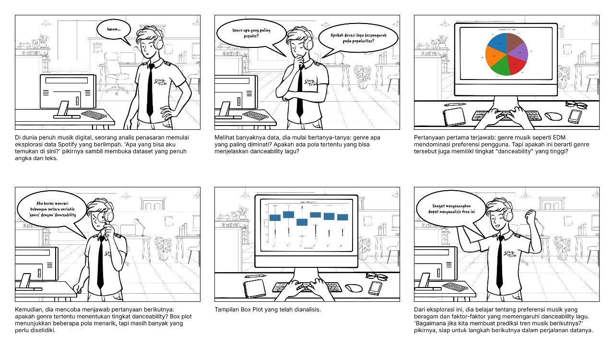

<!-- HEADER -->
 

  
   
  <h3 align="center">
    Learn More with Big Data
  </h3>
   

<!--Daftar Isi-->
## Daftar Isi

* [About](#about)
* [The Problem](#the-problem)
* [Our Solution - KnowMore](#our-solution---knowmore)
* [Workflow](#workflow)
* [Using KnowMore](#using-knowmore)
* [Using the Source Code](#using-the-source-code)
* [Reporting issues and contributing](#reporting-issues-and-contributing)
* [Cite us](#cite-us)
* [FAIR practices](#fair-practices)
* [License](#license)
* [Team](#team)
* [Acknowledgements](#acknowledgements)
  

<!--PENDAHULUAN-->
## Pendahuluan

Dataset "Spotify Songs" yang digunakan dalam penelitian ini dimiliki oleh <a href='https://github.com/rfordatascience/tidytuesday/blob/main/data/2020/2020-01-21/readme.md'>TidyTuesday<a/> yang merupakan data open source untuk analisis data. Dataset ini mencakup berbagai fitur audio, metadata lagu, dan metrik popularitas, seperti `danceability`, `energy`, `tempo`, `acousticness`, dan `popularity`. Data ini merepresentasikan kumpulan informasi penting dari platform Spotify yang memberikan wawasan tentang bagaimana lagu-lagu dikonsumsi oleh audiens. Dengan total 23 variabel, dataset ini menjadi peluang menarik bagi para analis data untuk memahami hubungan antara karakteristik lagu dan popularitasnya.
 

Namun, Data yang kompleks memberikan tantangan tersendiri bagi para analis. Berbagai fitur audio memiliki skala dan distribusi yang berbeda, sehingga sulit untuk menyimpulkan pola secara langsung. Selain itu, permasalahan lain seperti adanya nilai yang hilang atau anomali dalam beberapa variabel dapat mengurangi keakuratan analisis.
 

Untuk mengatasi tantangan ini, kami menggunakan teknik pembersihan data, eksplorasi statistik deskriptif, dan visualisasi data untuk mengidentifikasi pola utama. Tujuan dari penelitian ini adalah memberikan pemahaman yang lebih baik tentang hubungan antara fitur audio dengan tipe lagunya. Dengan demikian, penelitian ini diharapkan dapat memberikan wawasan bagi musisi dalam menciptakan strategi musik yang lebih efektif dan sesuai dengan preferensi audiens.
 

### 1.1 Rumusan Masalah
Berdasarkan latar belakang yang telah ditulis di atas, maka rumusan masalah yang dapat di fokuskan pada penelitian ini yaitu :
1. a
2. b
3. c

### 1.2 Solusi Mengatasi Masalah
Solusi dalam penelitian ini berfokus pada penyelesaian dari rumusan masalah. Berdasarkan rumusan masalah diatas, maka solusinya yaitu :
1. a
2. b
3. c

### 1.3 Teknik Analisis yang Diusulkan
Dalam memberikan solusi, kami menggunakan teknik analisis berikut :
1. Statistik deskriptif untuk mengidentifikasi tren.
2. Visualisasi data untuk hubungan antar variabel.
3. Teknik lainnya apalagi hehe

### 1.4 Manfaat Analisis
Sehingga penelitian ini dapat memberikan manfaat sebagai berikut :
1. Memahami hubungan antara fitur audio dengan tipe lagunya
2. Memberikan strategi bagi musisi untuk menciptakan lagu yang efektik
3. Mengedukasi audiens dengan visualisasi yang lebih mudah dipahami

 

<!--DATA PREPARATION-->
## Data Preparation

### 3.1 Sumber Data

Data dalam penelitian ini bersumber dari Github <a href='https://github.com/rfordatascience/tidytuesday/blob/main/data/2020/2020-01-21/readme.md'>TidyTuesday<a/>. Dataset ini dapat dikunjungi dengan menekan hyperlink diatas atau klik <a href='https://github.com/rfordatascience/tidytuesday/blob/main/data/2020/2020-01-21/readme.md'>disini<a/>.

### 3.2 Tentang Data

### 3.3 Rumusan Masalah
### 3.4 Rumusan Masalah
### 3.5 Rumusan Masalah

